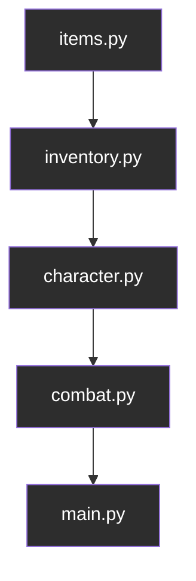
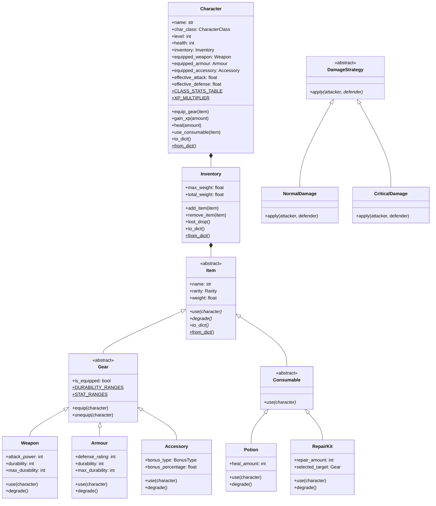
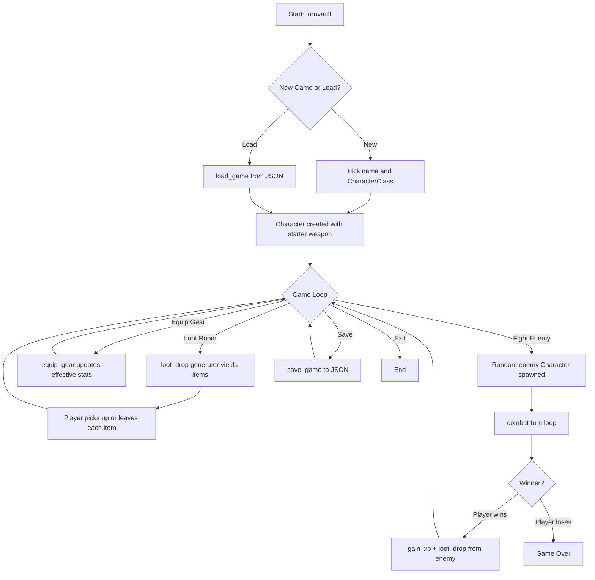

# IronVault

**A modular, extensible turn-based RPG engine written in modern Python.**

[](https://github.com/Rohitchandramouli/ironvault/actions/workflows/ci.yml)
[](https://www.python.org/downloads/release/python-3119/)
[](https://opensource.org/licenses/MIT)
[](https://github.com/astral-sh/ruff)
[](https://mypy-lang.org/)

IronVault uses an RPG inventory and combat system as a vehicle for demonstrating professional Python engineering — OOP, design patterns, type hints, serialization, testing, and CI/CD. Every architectural decision was made deliberately before a single line of code was written.

> For the personal story behind how this project was built — the scope decisions, the lessons, and what it meant — read the [blog post](https://rohitchandramouli.github.io/2026/07/09/ironvault-my-first-software-engineering-project/).

---

## Quick Start

```bash
pip install -e .
ironvault
```

**Requirements:** Python 3.11+

---

## What IronVault Does

IronVault is a fully playable CLI turn-based RPG engine with the following systems:

- **Character creation** — four archetypes (Sentinel, Executioner, Gladiator, Champion), each with distinct starting stats
- **Inventory management** — weight-limited item storage, gear/consumable separation, equip slots
- **Loot generation** — lazy generator yielding rarity-scaled items from a named pool per tier
- **Turn-based combat** — pluggable damage strategies, gear degradation mid-fight, bare-fisted fallback
- **Progression** — XP scaling, level-up with stat growth, post-combat loot drop
- **Save/load** — full game state serialization to JSON, corrupt save detection
- **Packaging** — installable via `pip install -e .`, exposed as `ironvault` console command

---

## Architecture

### Dependency Direction

Dependencies flow strictly one way. No file imports from anything above it in the chain.



This was a deliberate upfront constraint. It prevents circular imports, keeps every module independently testable, and makes the responsibility of each file unambiguous.

### Class Hierarchy



### Execution Flow



---

## Project Structure

```
ironvault/
├── src/
│   └── Ironvault/
│       ├── __init__.py         # Public API surface
│       ├── items.py            # Item hierarchy, enums, factory
│       ├── inventory.py        # Container, generator, dunders
│       ├── character.py        # Agent, stats, progression
│       └── combat.py           # Strategy pattern, turn loop
├── tests/
│   ├── conftest.py             # Shared fixtures
│   ├── test_items.py
│   ├── test_inventory.py
│   ├── test_character.py
│   ├── test_combat.py
│   └── test_save_load.py
├── .github/
│   └── workflows/
│       └── ci.yml              # pytest + ruff + mypy on every push
├── main.py                     # Entry point → run()
├── pyproject.toml
├── requirements.txt
└── LICENSE
```

---

## Module Reference

### `items.py` — What things are

The foundation of the dependency chain. Defines every object that can exist in the game world. No imports from any other IronVault module.

**Enums**

| Enum | Members |
|------|---------|
| `Rarity` | `C` (Common) · `UC` (Uncommon) · `R` (Rare) · `E` (Epic) · `L` (Legendary) |
| `BonusType` | `ATTACK` · `DEFENSE` · `HEALTH` |

**Item hierarchy**

```
Item (abstract)
├── Gear (abstract) — equippable, is_equipped flag
│   ├── Weapon      — attack_power, durability (rarity-scaled)
│   ├── Armour      — defense_rating, durability (rarity-scaled)
│   └── Accessory   — bonus_type, bonus_percentage (rarity-scaled per type)
└── Consumable (abstract) — use() returns True (signals removal)
    ├── Potion      — heal_amount (fixed)
    └── RepairKit   — repair_amount (fixed), selected_target set by caller
```

**Custom exceptions:** `BrokenItemError`

---

### `inventory.py` — Who owns what

Manages item ownership, weight limits, and loot generation. Imports from `items.py` only.

**Key behaviors**

| Method / Dunder | Behavior |
|-----------------|----------|
| `add_item(item)` | Weight check → routes via `isinstance` → raises `InventoryFullError` |
| `remove_item(item)` | Searches both lists → raises `ItemNotFoundError` if absent |
| `loot_drop()` | Generator — yields random items lazily, no side effects |
| `__len__` | Combined count across gear + consumables |
| `__contains__` | Membership check across both lists |
| `__iter__` | Yields gear first, then consumables |
| `__repr__` | `Inventory(items=N, weight=X.XX/Y.YYkg)` |
| `gear` / `consumables` | Properties returning safe copies — internal lists are private |
| `total_weight` | Computed property, never stored |

**Custom exceptions:** `InventoryFullError`, `ItemNotFoundError`

---

### `character.py` — Who acts

The core agent. Owns an `Inventory` (composition, not inheritance). Serves as both player character and enemy — there is no separate `Enemy` class.

**Class stats table** (class variable — shared across all instances)

| Class | Health | Attack | Defense | Max Weight |
|-------|--------|--------|---------|------------|
| Sentinel | 150 | 15 | 45 | 45 kg |
| Executioner | 80 | 50 | 5 | 25 kg |
| Gladiator | 160 | 35 | 15 | 35 kg |
| Champion | 95 | 25 | 40 | 30 kg |

**Properties**

```python
effective_attack   # base_attack + (accessory % of base) + weapon.attack_power
effective_defense  # base_defense + (accessory % of base) + armour.defense_rating
level_up_threshold # int(level * 100 * XP_MULTIPLIER)
```

Broken gear (durability == 0) silently contributes nothing to effective stats. The item stays equipped and visible but acts as if absent.

---

### `combat.py` — What happens between them

Strategy pattern for damage calculation. The turn loop never changes when new damage types are added — only strategy classes change.

```python
calculate_damage(attack, defense) -> float  # pure function, clamps at 0
```

| Strategy | Behavior |
|----------|----------|
| `NormalDamage` | `calculate_damage(attacker.effective_attack, defender.effective_defense)` |
| `CriticalDamage` | Normal damage × 1.5 |

**Turn structure**

```
char_a attacks → damage applied → gear degrades → broken check → log + print
↓ (if char_b still alive)
char_b attacks → damage applied → gear degrades → broken check → log + print
↓ (repeat)
```

Returns `CombatResult(winner, defeated, turn_count, final_health)`.

---

### `main.py` — How it all fits together

Orchestration only. No game logic. Coordinates all four systems into a playthrough.

```python
save_game(character, filename)  # context manager + json.dump
load_game(filename) -> Character  # raises CorruptSaveError on bad JSON
run()  # console entry point
```

**Custom exceptions:** `CorruptSaveError`

---

## Python Fundamentals Demonstrated

| Concept | Where |
|---------|-------|
| Abstract base classes | `Item`, `Gear`, `Consumable`, `DamageStrategy` |
| Inheritance (2 levels deep, 2 branches) | `Item → Gear → Weapon/Armour/Accessory` and `Item → Consumable → Potion/RepairKit` |
| Composition over inheritance | `Character` *has* `Inventory`, does not extend it |
| Class variables | `CLASS_STATS_TABLE`, `XP_MULTIPLIER`, `STAT_RANGES`, `DURABILITY_RANGES` |
| `classmethod` factory | `Item.from_dict()`, `Character.from_dict()` |
| `staticmethod` pure function | `calculate_damage()` |
| Property decorators | `effective_attack`, `effective_defense`, `total_weight`, `gear`, `consumables`, `level_up_threshold` |
| Dunder methods | `__len__`, `__contains__`, `__iter__`, `__repr__` on `Inventory` |
| Generators | `loot_drop()` — lazy item production, no side effects |
| Enums | `Rarity`, `BonusType`, `CharacterClass` |
| Dataclasses | `CombatResult` |
| Type hints | Every method signature across all files |
| Custom exceptions | `BrokenItemError`, `InventoryFullError`, `ItemNotFoundError`, `CorruptSaveError` |
| Context managers | `save_game()`, `load_game()` file handling |
| JSON serialization | `to_dict()` / `from_dict()` full round-trip on `Item` and `Character` |
| Logging | `logging.INFO` / `WARNING` to file, separated from player-facing `print()` |
| Design patterns | Factory (`Item.from_dict()`), Strategy (`DamageStrategy`) |
| `unittest.mock` | `MagicMock` in `test_items.py` for isolated item testing |
| Packaging | `pyproject.toml`, `pip install -e .`, `ironvault` console command |
| CI/CD | GitHub Actions — pytest + ruff + mypy on every push |

---

## Testing

```bash
pip install -e .[dev]
pytest tests/ -v
```

30 tests across 5 files.

| File | Tests | Covers |
|------|-------|--------|
| `test_items.py` | 6 | `use()`, `degrade()`, `BrokenItemError`, `from_dict()` round-trip |
| `test_inventory.py` | 10 | routing, weight limits, dunders, `loot_drop()` |
| `test_character.py` | 8 | effective stats, broken gear, `gain_xp()`, level-up |
| `test_combat.py` | 3 | `calculate_damage()`, `NormalDamage`, `CriticalDamage` |
| `test_save_load.py` | 3 | round-trip, `save_game()`/`load_game()`, `CorruptSaveError` |

Fixtures use fixed deterministic values so tests are reproducible regardless of random generation. `MagicMock` isolates item tests from `Character` implementation.

---

## CI/CD

Every push and pull request to `main` runs:

```
checkout → setup Python 3.11 → pip install -e .[dev] → pytest → ruff → mypy
```

All three gates must pass. See [`.github/workflows/ci.yml`](.github/workflows/ci.yml).

---

## Engineering Decisions

These are the decisions that shaped the architecture. Each one has a reason.

**Why one-way dependency direction?**
Circular imports in Python are a real runtime problem, not just a style concern. Enforcing a strict `items → inventory → character → combat → main` chain means every module can be imported, tested, and reasoned about in isolation. It also makes the responsibility of each file obvious from its position in the chain.

**Why composition over inheritance for `Character`?**
`Character` *has* an `Inventory`, it does not *extend* one. Inheritance would mean every `Character` method also inherits every `Inventory` method — a fragile coupling that makes the class harder to reason about and extend. Composition keeps responsibilities separated: `Character` is an agent, `Inventory` is a container.

**Why abstract base classes over duck typing?**
The contracts here — every `Item` must implement `use()`, `degrade()`, and `to_dict()` — need to be enforced at class definition time, not discovered at runtime when a missing method causes an unexpected `AttributeError` mid-combat. ABCs make contract violations fail at the right moment, with the right error.

**Why is `Item` lean?**
`Item` only defines what is true of every single item without exception: `name`, `rarity`, `weight`, and the three abstract method contracts. Attributes that only apply to some subclasses — `durability` for `Weapon`/`Armour`, `bonus_percentage` for `Accessory` — live on those subclasses only. A generic shared `condition` field that subclasses reinterpret was explicitly rejected as crowding the base class with irrelevant state.

**Why does `Gear` exist as a separate layer?**
`Gear` has one job: represent "this item is equippable" and provide `equip()`/`unequip()` hooks. It does not hold `durability` — that lives on `Weapon` and `Armour` individually, because `Accessory` has no durability concept. Adding durability to `Gear` would force `Accessory` to carry a field it never uses, the same crowding problem avoided in `Item`.

**Why does `Consumable.use()` return `True`?**
`Consumable.use()` returns `True` to signal "remove me from inventory." The alternative — having the item hold a back-reference to its containing `Inventory` and remove itself — would create a dependency from `items.py` upward to `inventory.py`, violating the one-way dependency direction. The return value signal keeps the dependency chain intact.

**Why does `loot_drop()` have no side effects?**
The generator yields items and does nothing else. `main.py` is responsible for calling `add_item()` on each yielded item and handling `InventoryFullError` if the bag fills mid-loot. This keeps "generating loot" and "managing inventory capacity" as separate, independent concerns. It also means the player makes an explicit decision to pick up each item — player agency over automatic collection.

**Why are equipped items not moved out of inventory?**
When gear is equipped, it stays in `_gear` with `is_equipped = True`. It was not moved to a separate holder on `Character`. This means `total_weight` correctly includes worn gear, and there is exactly one source of truth for everything a character possesses. Two lists tracking the same items would be a synchronization bug waiting to happen.

**Why does `Character` serve as both player and enemy?**
There is no separate `Enemy` class. Both the player and any enemy are `Character` instances. `combat()` operates only against the `Character` interface — it never checks which one is the player. This avoids duplicating logic and mirrors how real game engines handle entity identity: a Sentinel enemy and a Sentinel player are the same class with different names.

**Why does `effective_attack` apply the accessory bonus to base stat only?**
If the accessory bonus applied to the already-equipment-modified effective stat, equip order would matter — equipping a weapon then an accessory would give a different result than the reverse. Applying the bonus to `base_attack` only makes the calculation order-independent. Same equip sequence, same result, always.

**Why the Strategy pattern for damage?**
`DamageStrategy` with `NormalDamage` and `CriticalDamage` means `combat()`'s turn loop never changes when new damage types are added. Only new strategy classes are written. This satisfies the Open/Closed Principle — the combat engine is open for extension (new strategies) and closed for modification (the loop itself).

**Why `Item.from_dict()` as the single construction point?**
All item construction — from `loot_drop()`, from `load_game()`, from `Character.from_dict()` — flows through this one classmethod factory. If construction logic lived in each callsite, changes to how items are built would require finding and updating multiple places. Centralizing it means one change propagates everywhere automatically.

**Why `logging` to file instead of printing everything?**
`print()` is reserved for player-facing narrative output. All internal system events — equip stat changes, XP gain, level-up, combat turns, broken gear — go to `ironvault.log` via `logging.INFO` or `logging.WARNING`. This keeps the terminal clean for the player and keeps diagnostics available for the developer without mixing the two concerns.

**Why properties for `effective_attack` and `effective_defense`?**
These values are computed from current state — base stats, equipped gear, accessory bonuses, durability. Storing them as fields would mean updating them on every equip, unequip, degrade, and level-up. As properties, they're always correct by construction. No synchronization required.

**Why `total_weight` as a property?**
Same reasoning. Storing it as a field would require updating it on every `add_item()` and `remove_item()`. As a property, it's computed fresh from the actual items in both lists whenever accessed. No cached state to go stale.

---

## Future Extensions

These were explicitly deferred — designed but not implemented — during the initial build.

- **Rarity-scaled consumables** — Potions and RepairKits currently have fixed values. The design anticipated rarity scaling but deferred it when consumables were simplified.
- **Potency decay** — Potions degrading over dungeon room progression. `degrade()` is already abstract on `Potion`, ready to be implemented.
- **Agility-based turn order** — Combat currently gives `char_a` initiative always. Speed stat determining who acts first.
- **Per-class stat growth rates** — Level-up currently applies a flat 10% to all stats regardless of class. Sentinel growing defense faster than Executioner was designed but deferred.
- **Dual weapon slots** — Single weapon slot enforced. Architecture supports multiple slots with minimal changes.
- **Shop mechanic** — Gear repair via shop NPC. Currently repair-kit only.
- **Enemy difficulty scaling** — Enemies spawn at level 1 always. Scaling enemy level to player level for progressive difficulty.
- **Weighted rarity probability** — `loot_drop()` currently selects rarity uniformly. Weighted `random.choices()` to make Common drops far more likely than Legendary.
- **Observer pattern for combat events** — Design proposed `WeaponBrokenEvent`, `LevelUpEvent` etc. so UI, logger, and future systems could listen independently.
- **ECS migration** — Entity Component System as the next architectural layer beyond what's here.

---

## Development Setup

```bash
# Clone
git clone https://github.com/Rohitchandramouli/ironvault
cd ironvault

# Install in editable mode with dev tools
pip install -e .[dev]

# Run the game
ironvault

# Run tests
pytest tests/ -v

# Lint
ruff check src/

# Type check
mypy src/
```

---

## Context

IronVault is the first project in a structured six-month ML engineering sprint — the Python and software engineering foundation before moving into NumPy, PyTorch, transformers, and reinforcement learning. The goal of this project specifically was to demonstrate Python mastery at the level expected of an ML engineer: not just knowing the syntax, but understanding when and why to use each feature.

For the full story of how it was built, read the [blog post](https://rohitchandramouli.github.io/2026/07/09/ironvault-my-first-software-engineering-project/).

---

## License

[MIT](LICENSE)
