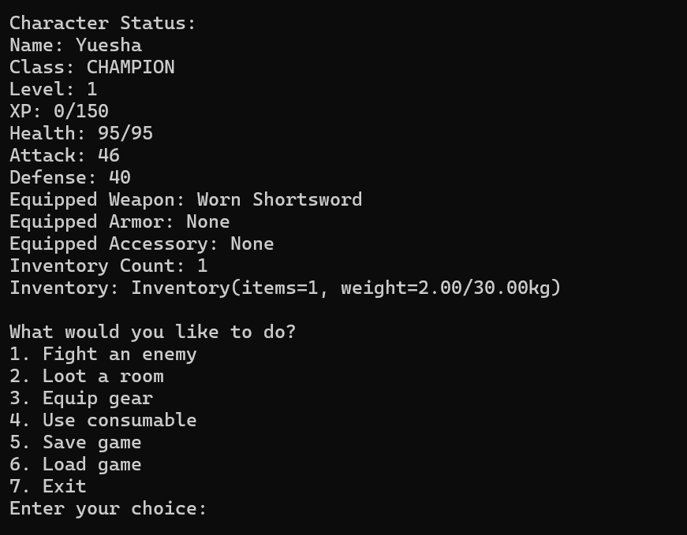
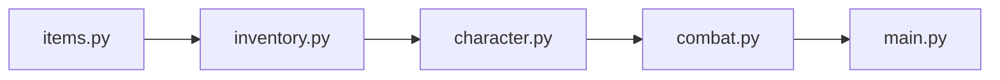
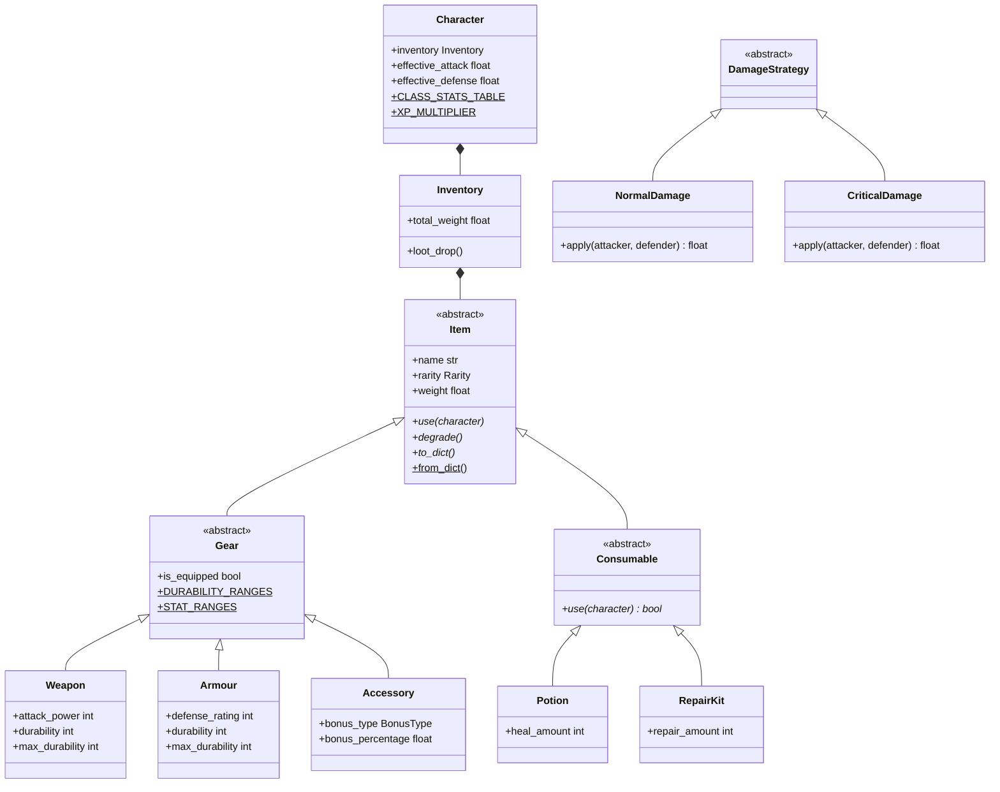
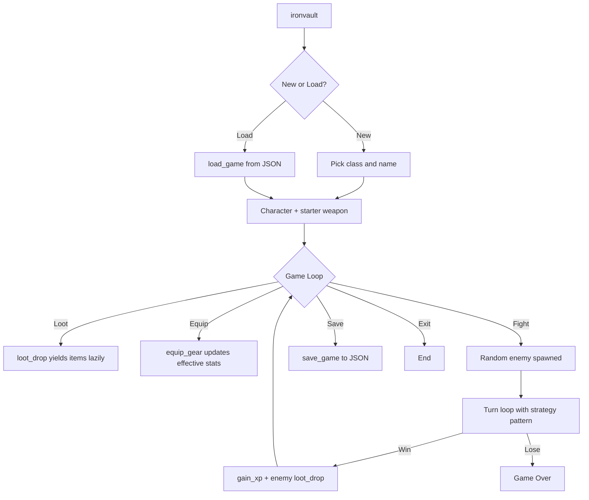

# IronVault

**A modular, extensible turn-based RPG engine written in modern Python.**

[](https://github.com/Rohitchandramouli/ironvault/actions/workflows/ci.yml)
[](https://www.python.org/downloads/release/python-3119/)
[](https://opensource.org/licenses/MIT)
[](https://github.com/astral-sh/ruff)
[](https://mypy-lang.org/)

> ~2,500 lines · 5 modules · 30 tests · 100% typed · CI passing

---

## Why This Project Exists

I built IronVault to answer a straightforward question: can I design and implement a medium-sized Python system using the same engineering principles found in production software — before writing a single line of code?

Instead of focusing on gameplay or graphics, the focus was on **architecture, maintainability, testing, and extensibility**. The RPG domain provides a realistic environment in which to demonstrate those principles — items, inventories, characters, and combat map naturally onto OOP concepts without the problem feeling contrived.

IronVault is the first project in a structured six-month ML engineering sprint. Its job is to establish that clean, maintainable Python is a baseline — before moving into NumPy, PyTorch, and reinforcement learning. For the personal story behind how it was built, read the [blog post](https://rohitchandramouli.github.io/2026/07/09/ironvault-my-first-software-engineering-project/).

---

## Quick Start

```bash
pip install -e .
ironvault
```

**Requirements:** Python 3.11+

```bash
pip install -e .[dev]
pytest tests/ -v   # 30 tests
ruff check src/    # lint
mypy src/          # type check
```

---

## What It Looks Like



A Champion named Yuesha, freshly equipped with a Worn Shortsword, standing at the game loop menu. Every stat shown — attack, defense, inventory weight — is computed dynamically from equipped items and base class stats.

---

## What IronVault Does

A fully playable CLI turn-based RPG engine with five interconnected systems:

- **Items** — rarity-scaled weapons, armour, accessories, potions, and repair kits. Each has a full lifecycle: use, degrade over time, serialize to JSON, reconstruct exactly from saved data.
- **Inventory** — weight-limited container with gear/consumable separation, a lazy loot generator, and protected internal state. Exposes a natural Python interface via dunder methods.
- **Characters** — four archetypes (Sentinel, Executioner, Gladiator, Champion) with distinct starting stats, equipment slots, XP, and leveling. Both the player and enemies are the same class.
- **Combat** — pluggable damage strategies, mid-fight gear degradation, bare-fisted fallback when weapons break, post-combat XP and loot.
- **Save/Load** — full game state serialization to JSON with corrupt save detection.

---

## Architecture

Dependencies flow strictly one way. No file imports from anything above it in the chain.



This was a deliberate upfront constraint — not a refactoring outcome. Every module is independently testable, and the responsibility of each file is unambiguous from its position in the chain.

### Class Hierarchy



### Execution Flow



---

## Project Structure

```text
ironvault/
├── src/
│   └── Ironvault/
│       ├── __init__.py         # Public API surface
|       ├── main.py             # Entry point → run()
│       ├── items.py            # Item hierarchy, enums, factory
│       ├── inventory.py        # Container, generator, dunders
│       ├── character.py        # Agent, stats, progression
│       └── combat.py           # Strategy pattern, turn loop
├── tests/
│   ├── conftest.py             # Shared fixtures (deterministic)
│   ├── test_items.py
│   ├── test_inventory.py
│   ├── test_character.py
│   ├── test_combat.py
│   └── test_save_load.py
├── docs/
│   ├── Architecture.md         # Module reference and internals
│   ├── Engineering-Decisions.md # Why each design choice was made
│   └── Future-Extensions.md    # Deferred features with reasoning
├── .github/
│   └── workflows/ci.yml        # pytest + ruff + mypy on every push
├── pyproject.toml
├── requirements.txt
└── LICENSE
```

---

## Key Engineering Decisions

The full reasoning behind every architectural choice — including what changed during implementation and why — lives in [`docs/Engineering-Decisions.md`](docs/Engineering-Decisions.md). Here are the decisions that shaped the design most.

**One-way dependency direction** — Enforced before implementation began, not discovered through refactoring. Every module can be imported, tested, and reasoned about in isolation.

**Composition over inheritance for `Character`** — `Character` *has* an `Inventory`, it does not extend one. Inheritance would couple every `Character` method to every `Inventory` method. Composition keeps them independent.

**Abstract base classes over duck typing** — Contracts need to be enforced at class definition time, not discovered at runtime when a missing method causes an unexpected `AttributeError` mid-combat.

**`Item` is lean by design** — Only defines what is true of every single item without exception. A shared `condition` field that subclasses reinterpret was explicitly rejected as crowding the base class with irrelevant state.

**Strategy pattern for damage** — `combat()`'s turn loop never changes when new damage types are added. Open for extension, closed for modification.

**`Item.from_dict()` as single construction point** — All item construction — from `loot_drop()`, `load_game()`, `Character.from_dict()` — flows through one classmethod factory. One place to change, one place to test.

**Logging separated from print** — `print()` is for player-facing output only. All internal events go to `ironvault.log`. Two separate concerns, never mixed.

---

## Testing

```bash
pytest tests/ -v
```

| File | Tests | What it covers |
| ------ | ------- | ---------------- |
| `test_items.py` | 6 | `use()`, `degrade()`, `BrokenItemError`, `from_dict()` round-trip |
| `test_inventory.py` | 10 | routing, weight limits, `__len__`, `__contains__`, `__iter__`, `loot_drop()` |
| `test_character.py` | 8 | effective stats, broken gear, `gain_xp()`, level-up stat increase |
| `test_combat.py` | 3 | `calculate_damage()`, `NormalDamage`, `CriticalDamage` |
| `test_save_load.py` | 3 | round-trip, `save_game()`/`load_game()`, `CorruptSaveError` |

Fixtures use fixed deterministic values — reproducible regardless of random generation. `MagicMock` isolates item tests from `Character` implementation. `pytest.approx()` handles float comparisons from accessory bonus calculations.

---

## What I Learned

- **Designing responsibilities before writing code reduced bugs dramatically.** Almost every bug found during implementation was a design gap, not a syntax error.
- **Composition produced a cleaner design than inheritance would have.** `Character` owning `Inventory` is easier to reason about than `Character` extending it.
- **Serialization is much easier when every object owns its own persistence.** `to_dict()` / `from_dict()` on every class made save/load almost mechanical to implement.
- **Automated tests made later refactoring much safer.** Changing `gain_xp()` mid-build and knowing immediately whether anything broke changed how I think about writing code.
- **Logging and player output should be strictly separated.** Mixing them creates noise that makes debugging harder. One concern, one channel.

---

## CI/CD

Every push and pull request runs:

```text
checkout → setup Python 3.11 → pip install -e .[dev] → pytest -v → ruff check → mypy
```

All three gates must pass. See [`.github/workflows/ci.yml`](.github/workflows/ci.yml).

---

## Documentation

The deeper detail lives in `docs/`:

| Document | Contents |
| ---------- | ---------- |
| [`docs/Architecture.md`](docs/Architecture.md) | Module reference, class stats table, rarity scaling tables, item hierarchy internals, public API surface |
| [`docs/Engineering-Decisions.md`](docs/Engineering-Decisions.md) | All 27 original design decisions plus every decision that changed during implementation, with reasoning |
| [`docs/Future-Extensions.md`](docs/Future-Extensions.md) | Deferred features with design notes and clear implementation paths |

The blog post covers the personal side — scope decisions, what cost more than expected, and why this project mattered: [IronVault: My First Software Engineering Project](https://rohitchandramouli.github.io/2026/07/09/ironvault-my-first-software-engineering-project/).

---

## License

[MIT](LICENSE)
